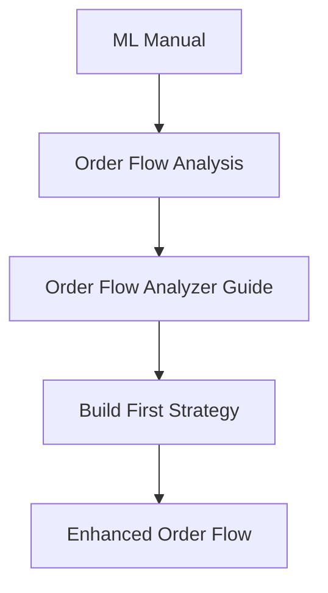
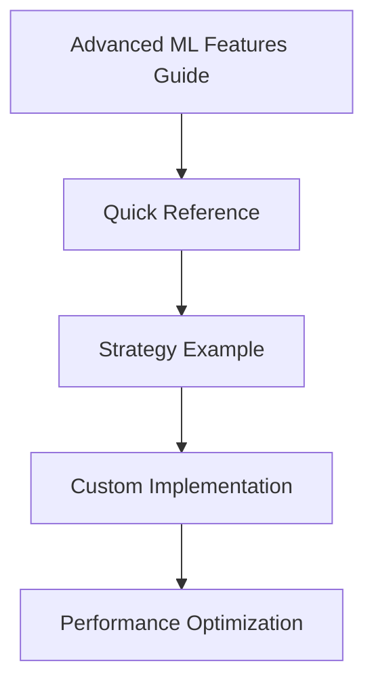
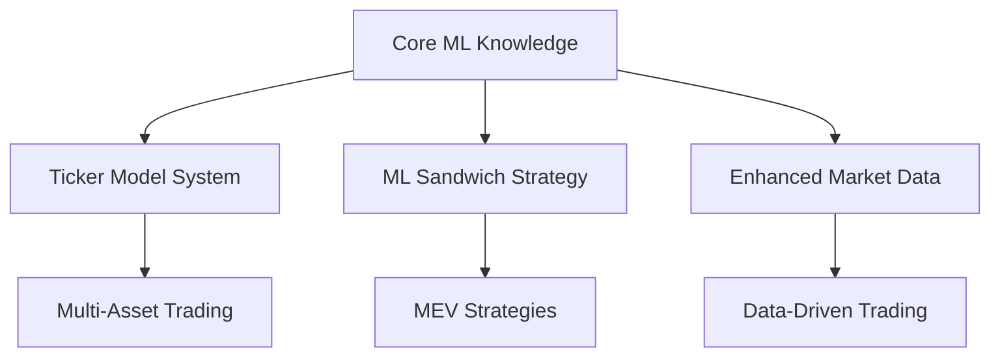

# ML Documentation Index

Welcome to the comprehensive machine learning documentation for the Quantify trading framework. This directory contains all the resources you need to leverage advanced ML capabilities in your trading strategies.

## 🎯 Quick Start Guide

### New to ML in Trading?
1. Start with [ML Manual](../ml_manual.md) - Core concepts and basic usage
2. Read [Order Flow Analysis](order_flow_analysis.md) - Understanding market microstructure
3. Try [Order Flow Analyzer Guide](order_flow_analyzer_guide.md) - Practical implementation

### Ready for Advanced Features?
1. **[Advanced ML Features Guide](advanced_ml_features_guide.md)** - Complete documentation
2. **[Advanced ML Features Quick Reference](advanced_ml_features_quick_reference.md)** - Code snippets and patterns
3. **[Advanced ML Strategy Example](advanced_ml_strategy_example.md)** - Real-world implementation

## 📚 Documentation Structure

### Core ML Framework
| Document | Description | Best For |
|----------|-------------|----------|
| [ML Manual](../ml_manual.md) | Complete ML system overview | Learning fundamentals |
| [Order Flow Analysis](order_flow_analysis.md) | Market microstructure concepts | Understanding theory |
| [Order Flow Analyzer Guide](order_flow_analyzer_guide.md) | Implementation guide | Building basic strategies |

### Advanced ML Features
| Document | Description | Best For |
|----------|-------------|----------|
| [Advanced ML Features Guide](advanced_ml_features_guide.md) | Comprehensive feature documentation | Deep understanding |
| [Advanced ML Features Quick Reference](advanced_ml_features_quick_reference.md) | Code snippets and patterns | Quick implementation |
| [Advanced ML Strategy Example](advanced_ml_strategy_example.md) | Complete strategy example | Real-world application |

### Enhanced Order Flow
| Document | Description | Best For |
|----------|-------------|----------|
| [Enhanced Order Flow Guide](enhanced_order_flow_guide.md) | Advanced order flow patterns | Sophisticated analysis |
| [Enhanced Order Flow Quick Reference](enhanced_order_flow_quick_reference.md) | Quick patterns and tips | Fast implementation |
| [Enhanced Market Data Guide](enhanced_market_data_guide.md) | Market data integration | Data handling |

### Specialized Topics
| Document | Description | Best For |
|----------|-------------|----------|
| [Ticker Model System](ticker_model_system.md) | Symbol-specific models | Multi-asset strategies |
| [ML Sandwich Strategy Guide](ml_sandwich_strategy_guide.md) | MEV detection strategies | DeFi/DEX trading |

## 🚀 Getting Started Paths

### Path 1: Basic ML Trading


### Path 2: Advanced ML Features


### Path 3: Specialized Applications


## 🔧 Implementation Checklist

### Basic Setup
- [ ] Read [ML Manual](../ml_manual.md) sections 1-3
- [ ] Understand [Order Flow Analysis](order_flow_analysis.md) concepts
- [ ] Configure basic OrderFlowAnalyzer
- [ ] Test with paper trading

### Advanced Features Setup
- [ ] Read [Advanced ML Features Guide](advanced_ml_features_guide.md)
- [ ] Configure `config/ml/advanced_features_config.yaml`
- [ ] Enable advanced features in your strategy
- [ ] Test all three modules (imbalance, regime, liquidity)

### Strategy Development
- [ ] Study [Advanced ML Strategy Example](advanced_ml_strategy_example.md)
- [ ] Implement your custom strategy
- [ ] Set up performance monitoring
- [ ] Backtest and optimize

### Production Deployment
- [ ] Configure logging and monitoring
- [ ] Set up model persistence
- [ ] Implement risk management
- [ ] Deploy with gradual scaling

## 💡 Key Concepts

### Order Flow Analysis
**What it is**: Analysis of how orders flow through the market
**Why it matters**: Reveals hidden institutional activity and market sentiment
**How to use**: Detect large orders, iceberg orders, and order flow imbalances

### Advanced ML Features
**What they are**: Three sophisticated modules for market microstructure analysis
**Why they're powerful**: Extract alpha from order book data, not just price data
**How they work**: Combine imbalance momentum, regime classification, and liquidity analysis

### Market Regimes
**What they are**: Different market phases (accumulation, distribution, trending, etc.)
**Why they matter**: Different strategies work better in different regimes
**How to use**: Adapt your strategy based on current regime

### Liquidity Analysis
**What it is**: Understanding market maker behavior and liquidity provision
**Why it's important**: Avoid liquidity traps and time entries better
**How to apply**: Use liquidity stress scores to adjust position sizing

## 📊 Feature Comparison

| Feature | Basic ML | Advanced ML | Specialized |
|---------|----------|-------------|-------------|
| **Order Flow Detection** | ✅ | ✅ | ✅ |
| **Pattern Recognition** | ✅ | ✅ | ✅ |
| **Imbalance Analysis** | Basic | Advanced | Expert |
| **Regime Classification** | ❌ | ✅ | ✅ |
| **Liquidity Analysis** | ❌ | ✅ | ✅ |
| **Multi-Timeframe** | ❌ | ✅ | ✅ |
| **Feature Interactions** | ❌ | ✅ | ✅ |
| **Real-time Adaptation** | ❌ | ✅ | ✅ |

## 🎛️ Configuration Templates

### Conservative Trading
```yaml
ml_config:
  confidence_threshold: 0.8
  max_position_size: 0.05
  enable_advanced_features: true
  regime_weight: 0.5
  liquidity_weight: 0.4
  imbalance_weight: 0.1
```

### Aggressive Trading
```yaml
ml_config:
  confidence_threshold: 0.6
  max_position_size: 0.15
  enable_advanced_features: true
  regime_weight: 0.3
  liquidity_weight: 0.2
  imbalance_weight: 0.5
```

### High-Frequency Trading
```yaml
ml_config:
  confidence_threshold: 0.7
  max_position_size: 0.08
  enable_advanced_features: true
  update_frequency: 0.5
  parallel_processing: true
```

## 🔍 Troubleshooting

### Common Issues
1. **Low Signal Accuracy**: Check confidence thresholds and feature importance
2. **Memory Issues**: Reduce history length and enable cleanup
3. **Slow Performance**: Enable parallel processing and optimize update frequency
4. **Model Drift**: Implement regular retraining and monitoring

### Debug Resources
- Enable debug logging in configuration
- Use performance monitoring tools
- Check feature importance regularly
- Monitor regime detection accuracy

## 📈 Performance Optimization

### Best Practices
1. **Start Conservative**: Use high confidence thresholds initially
2. **Monitor Everything**: Track all key metrics continuously
3. **Adapt Gradually**: Adjust parameters based on performance
4. **Keep Learning**: Retrain models with new data regularly

### Key Metrics to Track
- Signal accuracy and win rate
- Feature importance and stability
- Regime detection accuracy
- Liquidity prediction quality
- Risk-adjusted returns

## 🛠️ Development Tools

### Testing and Validation
- Paper trading environments
- Backtesting frameworks
- Performance analytics
- Risk assessment tools

### Monitoring and Logging
- Real-time dashboards
- Performance tracking
- Error monitoring
- Feature drift detection

## 📞 Support and Community

### Documentation Issues
- Check the troubleshooting section
- Review configuration examples
- Consult the quick reference guides

### Strategy Development
- Start with the example strategy
- Follow the implementation checklist
- Use the provided templates

### Advanced Features
- Read the comprehensive guide
- Review the quick reference
- Study the example implementation

## 🔮 Future Enhancements

### Planned Features
- Additional regime types
- Enhanced liquidity metrics
- Cross-asset analysis
- Advanced ensemble methods

### Community Contributions
- New feature modules
- Strategy examples
- Performance optimizations
- Documentation improvements

---

**Remember**: Start with the basics, master the fundamentals, then gradually incorporate advanced features. The advanced ML capabilities are powerful but require proper understanding and careful implementation.

For questions or contributions, refer to the main project documentation and community guidelines. 