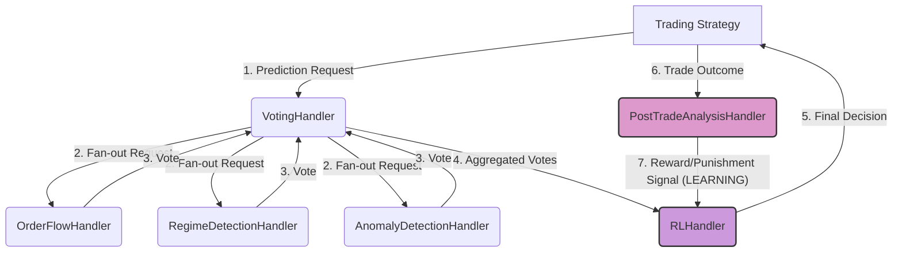

# AI Trading System: Architectural Overview

This document provides a comprehensive overview of the modular, microservice-based AI trading architecture. The system is designed for scalability, maintainability, and continuous learning, allowing for the easy integration of new models and strategies.

## Core Philosophy

The architecture is built on two core concepts:

1.  **A Generic Microservice Framework:** The foundation is a reusable `service_framework` that can host any number of independent services. It handles the low-level boilerplate of network communication (ZMQ), serialization (JSON/MessagePack), and request dispatching, allowing developers to focus purely on business logic.
2.  **A Committee of Experts with a Learning Decider:** The `ml_service` is the first implementation of this framework. It operates like a committee of specialized AI "experts" that analyze the market from different perspectives. Their collective wisdom is then used by a central Reinforcement Learning (RL) agent, which makes the final trading decisions and learns from their outcomes.

---

## The Automated ML Pipeline: From Data to Decision

The system is designed to be an intelligent, self-improving pipeline. Here is a step-by-step breakdown of the data flow and decision-making process:

1.  **Prediction Request:** The process begins when a trading strategy requests a prediction for a given ticker (e.g., ETH/USD).
2.  **Fan-Out to Models:** The request is sent to the `VotingHandler`. The `VotingHandler` then fans out the request to multiple, independent prediction models (`OrderFlowHandler`, `RegimeDetectionHandler`, `AnomalyDetectionHandler`).
3.  **Concurrent Predictions (The "Votes"):** Each model runs its analysis concurrently and returns a prediction—its "vote."
    *   The `OrderFlowHandler` predicts the likely direction of order flow.
    *   The `RegimeDetectionHandler` classifies the market state (e.g., trending, volatile, quiet).
    *   The `AnomalyDetectionHandler` flags any unusual patterns.
4.  **Vote Aggregation:** The `VotingHandler` collects all these votes. It aggregates them into a single, structured data object that represents the combined "wisdom" of our models.
5.  **RL Agent Decision:** This aggregated data is then passed to the `RLHandler`. The RL agent, our final decision-maker, takes the votes as its input state and decides on the best action (e.g., Buy, Sell, Hold).
6.  **Action and Feedback:** The RL agent's decision is sent back to the trading strategy, which executes the trade. The outcome of this trade (profit, loss, slippage) is then fed into the `PostTradeAnalysisHandler`.
7.  **Learning (The Feedback Loop):** The `PostTradeAnalysisHandler` analyzes the trade outcome and generates a "reward" or "punishment" signal. This signal is sent back to the `RLHandler` to update its internal policy. This is the crucial reinforcement learning step—the agent learns directly from the results of its past decisions.

This entire process is automatic. The RL agent continuously improves by learning from the feedback loop, and the entire system adapts to changing market conditions.

---

## Key Components

### 1. `service_framework`

This is the backbone of the entire system, located in `src/service_framework/`.

-   **`ServiceHost`:** The main server process. Its only job is to listen for requests and dispatch them to the correct registered handler. It knows nothing about trading or machine learning.
-   **`BaseHandler`:** An abstract class that defines the contract for all service handlers. It ensures that every handler implements `get_commands()` and `handle_request()`, guaranteeing consistency.
-   **`BaseClient`:** A generic client that other services or applications can use to communicate with a `ServiceHost`. It handles all the boilerplate of connection, serialization, and retries.

### 2. `ml_service`

This is our primary microservice, located in `src/ml_service/`. It is launched by running `python -m src.ml_service.main`.

#### DTOs (`dto.py`)

Data Transfer Objects define the "language" of the service. Key DTOs include:
- `Vote`: Represents a single opinion from one model.
- `VoteTally`: An aggregation of all votes on a topic.
- `Trade`: Represents a completed trade.
- `TradeFeedback`: The "lesson" generated from a trade's outcome.
- `AnomalyAlert`: A warning about unusual market conditions.

#### Handlers (`handlers/`)

These are the "experts" and core logic units:

-   **`OrderFlowHandler` & `RegimeDetectionHandler`:** Specialist models that analyze market data and cast votes based on their findings.
-   **`AnomalyDetectionHandler`:** A safety-focused model that looks for dangerous market conditions (e.g., flash crashes) and casts high-priority alert votes.
-   **`VotingHandler`:** The central "ballot box." It does not have any intelligence of its own; it simply collects votes from other services and provides tallied results upon request.
-   **`PostTradeAnalysisHandler`:** The "teacher." It analyzes trade performance and generates a reward signal for the RL agent.
-   **`RLHandler`:** The "brain." This is the central decision-maker and the only component that learns. It consumes vote tallies to make decisions and consumes trade feedback to improve its policy.

---

## How to Extend the System

The modular architecture makes extending the system straightforward. To add a new "expert" model (e.g., a sentiment analysis model):

1.  **Create a New Handler:** Create `SentimentAnalysisHandler.py` in the `handlers` directory. It must inherit from `BaseHandler`.
2.  **Implement Logic:** Write the code to analyze sentiment and determine a vote (e.g., `prediction='bullish'`).
3.  **Cast a Vote:** Use the `VotingServiceClient` to cast its vote to the `VotingHandler`.
4.  **Register the Handler:** In `src/ml_service/main.py`, import and register the new handler with the `ServiceHost`.

The `RLHandler` will automatically see the new votes from the sentiment model and, over time, learn how to incorporate this new source of information into its decisions without any changes to its own code. 