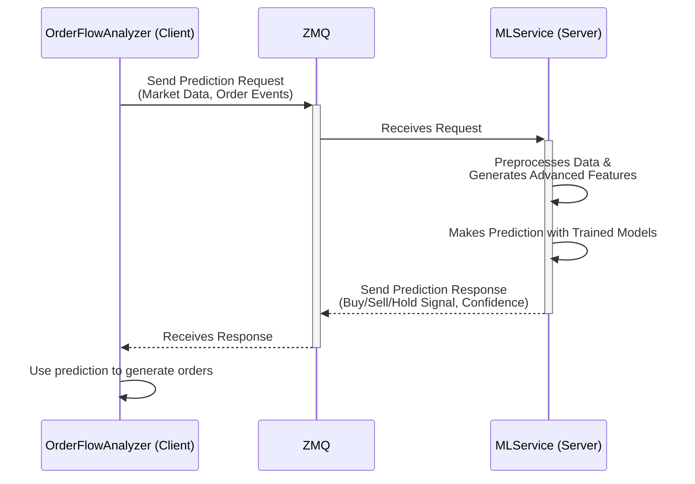
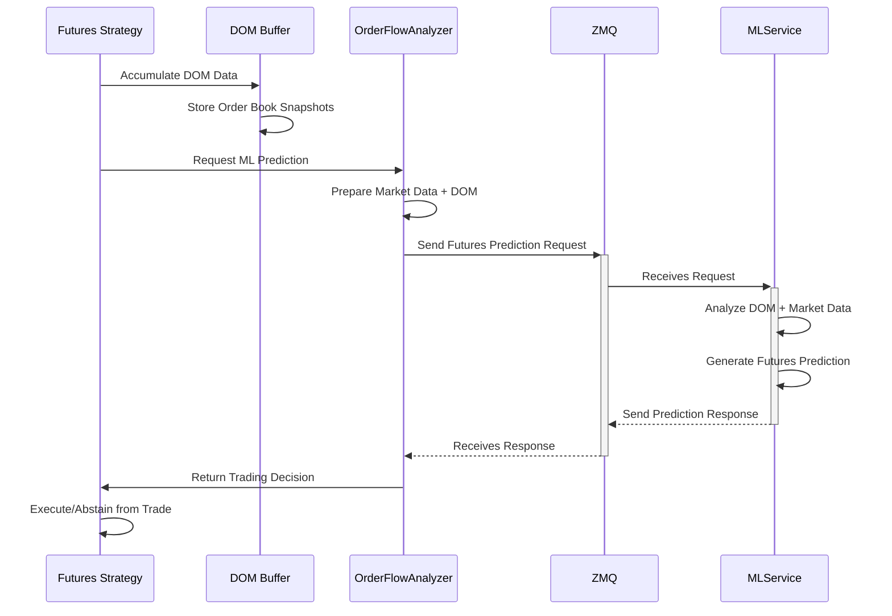

# ML Service Architecture

This document outlines the microservice-based architecture for handling machine learning model predictions and training within the strategy framework. This design decouples the ML model logic from the trading strategy, improving performance, scalability, and maintainability.

## Overview

The ML functionality is split into two main components:

1.  **`OrderFlowAnalyzer` (Client)**: Integrated within the main trading application, its primary role is to collect real-time market data, send it to the ML service for analysis, and receive predictions to inform trading decisions. For training, it collects and stores data locally, then simply triggers the training process on the service.
2.  **`MLService` (Server)**: A standalone Python application that exposes an API for ML-powered predictions and model training. It manages all aspects of the machine learning lifecycle, including data preprocessing, feature engineering, model training, and prediction.

Communication between the client and server is handled using a ZeroMQ (ZMQ) request-reply messaging pattern, which provides a lightweight and high-performance communication channel.

## Prediction Flow

The prediction process is designed for low-latency, real-time analysis.



1.  The `OrderFlowAnalyzer` gathers a recent window of market data and order events.
2.  It sends this data as a JSON payload to the `MLService` via a ZMQ `REQ` socket.
3.  The `MLService` receives the request, deserializes the data, and runs it through the `AdvancedMLFeatureEngine` to compute features like liquidity shocks and market regimes.
4.  The service uses its trained models to generate a prediction (e.g., a buy/sell signal and confidence score).
5.  The prediction is serialized and sent back to the `OrderFlowAnalyzer` as a ZMQ `REP`.
6.  The `OrderFlowAnalyzer` uses this prediction to inform its trading logic.

## Training Flow

The training process is designed to be efficient and to offload the computational heavy-lifting from the core trading application. Data is not sent over the network; instead, the service is triggered to read data from a shared file system.

```mermaid
graph TD
    subgraph "Trading Application"
        A[OrderFlowAnalyzer] -->|Appends training data| B(training_data.parquet);
        A -->|Sends 'train' command| C{ZMQ};
    end

    subgraph "ML Service"
        C -->|Receives 'train' command| D[MLService Server];
        D -->|Reads all data from| B;
        D -->|Trains all models| E[ML Models <br> (Traditional & Advanced)];
        E -->|Saves updated artifacts| F[Model Artifacts (.pkl, .joblib)];
    end

```

1.  As the `OrderFlowAnalyzer` processes market data, it identifies suitable samples for training.
2.  Instead of sending data directly, it appends these samples to a `training_data.parquet` file on disk. This file format is highly efficient for storing tabular data.
3.  When a training cycle is initiated (e.g., periodically or via a manual trigger), the `OrderFlowAnalyzer` sends a simple "train" command to the `MLService`.
4.  The `MLService` receives the command and begins the training process.
5.  It reads the entire `training_data.parquet` file.
6.  It uses this data to train (or retrain) all its models, including the traditional models and the advanced feature models (`IsolationForest`, `GaussianHMM`, etc.).
7.  Once training is complete, the service saves the updated model artifacts to disk for future predictions.

## Futures ML Integration

The ML service architecture has been extended to support futures trading strategies by integrating DOM (Depth of Market) data analysis with machine learning predictions. This functionality can be used across any futures strategy to enhance trading decisions.

### Futures Prediction Flow



### Key Features

#### 🎯 **Intelligent Trading Decisions**
- Uses ML predictions to determine when to enter futures positions
- Avoids trading during unfavorable market conditions
- Implements confidence thresholds to filter low-quality signals

#### 📊 **DOM Data Accumulation**
- Collects real-time order book data from futures markets
- Maintains historical DOM snapshots for analysis
- Standardizes data format for ML service consumption

#### 🤖 **ML Service Integration**
- Connects to the existing ML service infrastructure
- Sends market data, order book, and historical context
- Receives buy/sell/neutral signals with confidence scores

#### ⚡ **Performance Optimizations**
- Prediction cooldown to avoid excessive API calls
- Efficient data buffering with configurable history limits
- Fallback behavior when ML service is unavailable

#### 🔄 **Feedback Loop Learning**
- Records trading decisions and outcomes for ML learning
- Batches feedback data for efficient transmission
- Sends feedback to ML service for continuous model improvement

### Futures Strategy Configuration

To enable ML integration in any futures strategy, add the following configuration parameters:

```yaml
# DOM data accumulation
max_dom_history: 100      # Keep last 100 DOM snapshots
min_dom_samples: 10       # Minimum samples before prediction

# ML service settings
prediction_confidence_threshold: 0.6    # Minimum confidence to act
prediction_cooldown_seconds: 30         # Seconds between predictions

# ML service configuration
ml_service:
  host: "localhost"
  port: 5555
  timeout: 5.0
  retry_attempts: 3
  use_binary: true

# Feedback loop settings
max_feedback_buffer: 1000      # Maximum feedback samples to store
feedback_batch_size: 50        # Send feedback in batches
feedback_send_interval_minutes: 5  # Send feedback every 5 minutes

### Trading Decision Logic

Any futures strategy can implement this ML-driven decision flow:

1. **Check Position Status**: If there's an existing position, evaluate if action is needed
2. **Check Prediction Cooldown**: Avoid excessive ML service calls
3. **Verify DOM Data**: Ensure sufficient historical DOM data is available
4. **Request ML Prediction**: Send data to ML service for analysis
5. **Make Trading Decision**:
   - **BUY/STRONG_BUY** (confidence ≥ threshold): Execute buy strategy
   - **SELL/STRONG_SELL** (confidence ≥ threshold): Execute sell strategy or avoid trading
   - **NEUTRAL** (confidence ≥ threshold): No action
   - **Low Confidence**: Fall back to default strategy behavior
6. **Record Feedback**: Store decision and outcome for ML learning

### Data Sent to ML Service

Futures strategies send the following data structure to the ML service:

```python
{
    "order_events": [],  # Order events (if tracking individual orders)
    "market_data": {
        "timestamp": [...],
        "open": [...],
        "high": [...],
        "low": [...],
        "close": [...],
        "volume": [...]
    },
    "order_book": {
        "bids": [[price, size], ...],  # Top 10 levels
        "asks": [[price, size], ...]   # Top 10 levels
    }
}
```

### Feedback Data Structure

The feedback loop sends the following data structure to the ML service for learning:

```python
{
    "timestamp": "2024-01-15T10:30:15Z",
    "prediction_flow_type": "BUY",
    "prediction_confidence": 0.75,
    "trade_executed": True,
    "trade_outcome": "PROFIT",  # 'PROFIT', 'LOSS', 'BREAKEVEN', 'EXECUTED', None
    "market_data_snapshot": {
        "timestamp": "2024-01-15T10:30:15Z",
        "open": 18500.0,
        "high": 18525.0,
        "low": 18495.0,
        "close": 18520.0,
        "volume": 1500.0
    },
    "dom_data_snapshot": {
        "timestamp": "2024-01-15T10:30:15Z",
        "spread": 2.5,
        "mid_price": 18520.0,
        "bid_levels": 10,
        "ask_levels": 10
    }
}
```

### Usage Example

#### Deploy and Run ML-Enhanced Futures Strategy

```bash
# Deploy any futures strategy with ML integration
python main.py deploy-strategy --config config/strategies/your_futures_strategy.yaml

# Start the framework
python main.py start
```

#### Monitor ML Predictions

Strategies with ML integration provide detailed logging of predictions and trading decisions:

```
2024-01-15 10:30:15 | INFO | YourFuturesStrategy | Requesting ML prediction for trading decision...
2024-01-15 10:30:16 | INFO | YourFuturesStrategy | ML prediction received: BUY with confidence 0.75
2024-01-15 10:30:16 | INFO | YourFuturesStrategy | ML prediction: BUY with confidence 0.75
2024-01-15 10:30:16 | INFO | YourFuturesStrategy | Executing buy strategy based on ML signal...
```

### Testing Futures ML Integration

A comprehensive test script is available to verify the futures ML integration functionality:

```bash
# Test the ML integration functionality
python tests/test_futures_ml_integration.py
```

The test script validates:
1. ML service client initialization
2. DOM data accumulation and buffering
3. ML prediction requests and responses
4. Trading decision logic
5. Error handling and fallback behavior

### Performance Considerations

#### Memory Usage
- DOM data buffers consume memory proportional to `max_dom_history`
- Each DOM snapshot contains ~10 levels × 2 sides × 2 values = ~40 floats
- 100 snapshots ≈ 16KB per symbol

#### Network Latency
- ML service calls add latency to trading decisions
- Use `prediction_cooldown_seconds` to limit API calls
- Consider running ML service on same machine for lower latency

#### Fallback Behavior
- Strategies gracefully degrade when ML service is unavailable
- Fall back to default trading behavior
- Continue accumulating DOM data for when service returns

#### Feedback Loop Management
- Buffers feedback data locally to avoid network overhead
- Sends feedback in configurable batch sizes
- Evaluates trade outcomes after order completion
- Continues learning even when ML service is temporarily unavailable

### Troubleshooting

#### Common Issues

**ML Service Connection Failed**
```
Failed to initialize ML service client: Connection refused
```
*Solution*: Ensure the ML service is running on the configured host/port.

**Insufficient DOM Data**
```
Insufficient DOM data for ML analysis. Waiting for more data...
```
*Solution*: Check broker DOM subscription and increase `min_dom_samples` if needed.

**Low Prediction Confidence**
```
ML prediction confidence 0.45 below threshold 0.6
```
*Solution*: Lower `prediction_confidence_threshold` or check ML service model training status.

## Configuration

The connection between the client and server is configured in `config/main.yaml`:

```yaml
ml_service:
  client:
    host: "127.0.0.1"
    port: 5556
  server:
    host: "0.0.0.0"
    port: 5556
```

-   The **client** must be configured with the host and port where the `MLService` is listening.
-   The **server** is typically configured to listen on all interfaces (`0.0.0.0`) on a specific port.

This centralized configuration ensures that both components can connect without hardcoded values. 